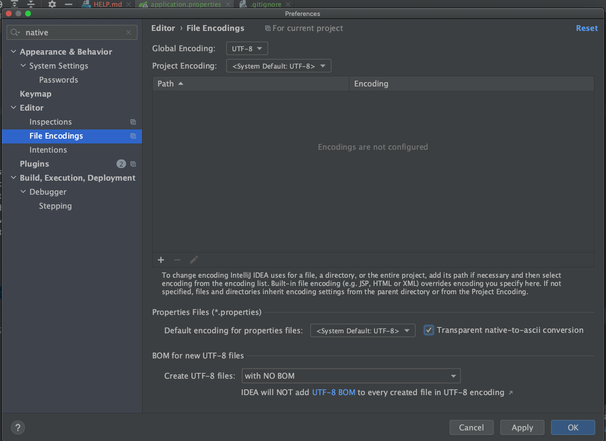

# What's this?
用百度云来存储音乐然后用该软件来播放的。

可能的配置项显示乱码：

勾上“Transparent native to ascii conversion”

# 配置
具体配置见：[application.properties](src/main/resources/application.properties)

# References

1. [baidu 控制台](http://developer.baidu.com/console#app/project)
