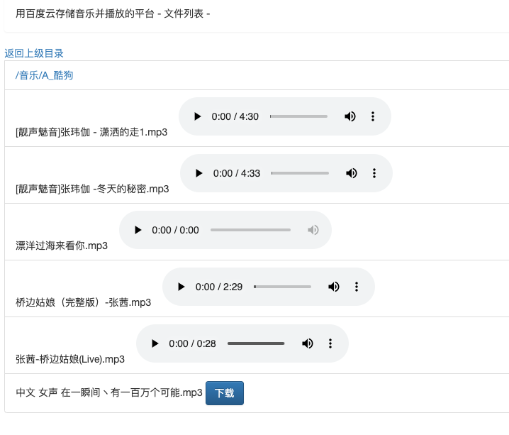

# What's this?
用百度云来存储音乐然后用该软件来播放的。 为啥要做？
1. 越来越多的歌听不了了
2. 酷狗的云盘太小 2G. 网易的云盘MAC上不支持上传。


可能的配置项显示乱码（如果配置文件中有中文的话）：


勾上“Transparent native to ascii conversion”

# 配置
具体配置见：[application.properties](src/main/resources/application.properties)

# 编译
`./gradlew build`

# 运行
1. 准备你的配置文件application.properties   可以参考上面的配置。 需要适当修改：
```
# the folder in baidu netdisk
# 云端的根目录
baidu.basedir=/音乐
# the local folder to store the data
# 本地数据
localtargetdir=./BaiduMusic
```

2. 运行:
```
java -jar build/libs/playwithme-0.0.1-SNAPSHOT.jar
```
3. 登录 打开：
   http://localhost:9096/
   
   
    然后登陆即可。
   

4. 然后就可以播放啦  目录结构与百度云音乐目录一致  如果本地没有需要先下载

   

# References

1. [baidu 控制台](http://developer.baidu.com/console#app/project)
